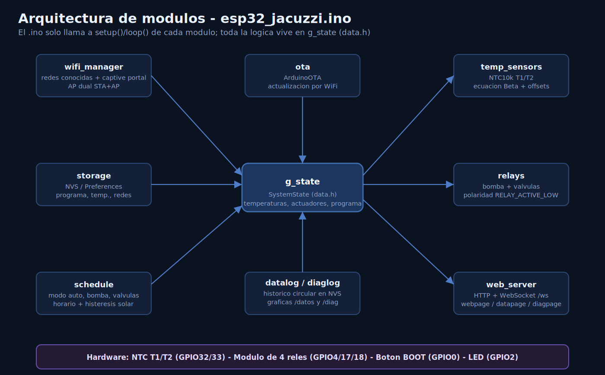
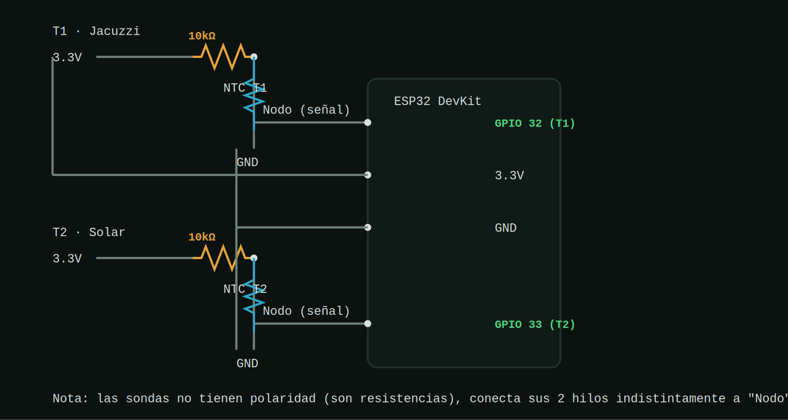

# Control Jacuzzi ESP32 (DevKit / NodeMCU-32S)


Proyecto completo: control de bomba, valvulas de desvio solar, sensores
de temperatura, programacion horaria y web de control en tiempo real.

📘 Manual de usuario oficial (instalacion, primer arranque y uso diario
paso a paso): **[Manual_Usuario_Jacuzzi_Controller.docx](Manual_Usuario_Jacuzzi_Controller.docx)**

## Arquitectura del firmware



El `.ino` no contiene logica propia: solo inicializa y llama a
setup()/loop() de cada modulo. Todos los modulos leen y escriben sobre
un unico estado compartido (`g_state`, definido en `data.h`), lo que
mantiene cada archivo pequeño, independiente y facil de reutilizar en
otro proyecto.

## Estructura del proyecto

```
esp32_jacuzzi/
├── esp32_jacuzzi.ino   -> Solo llama a setup/loop de cada modulo
├── config.h            -> Pines y constantes (LEER ANTES DE CABLEAR)
├── data.h              -> Estado global compartido (g_state)
├── storage.*           -> Guardado persistente (NVS / Preferences)
├── wifi_manager.*       -> WiFi: redes conocidas + portal de configuracion
├── relays.*             -> Control de bomba y valvulas
├── temp_sensors.*       -> Lectura de los 2 NTC10k (jacuzzi y solar)
├── schedule.*            -> Programa horario + logica de modo automatico
├── ota.*                 -> Actualizacion de firmware por WiFi
├── datalog.*             -> Historico de temperaturas/eventos (grafica /datos)
├── diaglog.*             -> Registro de diagnostico (heap, wifi, reinicios)
├── web_server.*          -> Servidor web + WebSocket
├── webpage.*             -> HTML de la app principal embebido en PROGMEM
├── datapage.*            -> HTML de la pagina /datos embebido en PROGMEM
└── diagpage.*            -> HTML de la pagina /diag embebido en PROGMEM
```

## Librerias necesarias (Gestor de Librerias del IDE de Arduino)

- **ESPAsyncWebServer** (me-no-dev / ESP32Async)
- **AsyncTCP** (dependencia de la anterior)
- **ArduinoJson** (v6 o v7)
- Todo lo demas (WiFi, WebServer, DNSServer, Preferences, ArduinoOTA,
  analogRead de los NTC) ya viene incluido con el core de ESP32 para
  Arduino, sin librerias externas adicionales.

## Configuracion de la placa

- Placa: **ESP32 DevKit / NodeMCU-32S**
- Particion: cualquiera por defecto sirve (ya no se usa ningun sistema
  de ficheros; la web viaja embebida dentro del propio sketch).
- Sube el sketch normalmente por USB, como cualquier otro proyecto de
  Arduino. No hay que subir nada aparte.

## Cableado (ver comentarios detallados en `config.h`)

| Señal                          | Pin ESP32 DevKit |
|---------------------------------|:---:|
| NTC T1 (jacuzzi)                | GPIO 32 |
| NTC T2 (solar)                  | GPIO 33 |
| Rele 1 - Bomba/Motor            | GPIO 4  |
| Rele 2 - Ambas valvulas (V1 NA / V2 NC) | GPIO 17 |
| Rele 4 - Libre / futuro         | GPIO 18 |
| Boton reset WiFi (boton BOOT)   | GPIO 0  |
| LED de estado (LED azul on-board) | GPIO 2  |

Los reles se colocaron en pines libres del NodeMCU-32S (GPIO 4, 17, 18),
sin conflicto con el flash ni con los NTC (32/33). Si tu modulo lleva
PSRAM (variante WROVER) no uses el GPIO 17, ya que esta reservado
internamente; en un NodeMCU-32S normal (WROOM) esta libre.

Las dos valvulas se mueven con un **unico rele**: al estar una en
posicion Normalmente Abierta y la otra en Normalmente Cerrada, activar
o desactivar ese rele las deja siempre en posiciones opuestas (reposo
= filtro directo / activado = desvio al serpentin solar).

Si tu modulo de reles es activo en HIGH en vez de en LOW, cambia
`RELAY_ACTIVE_LOW` a `false` en `config.h`.

### Esquema de conexion de los sensores NTC



**Sensores NTC10k B3950 (analogicos, 2 hilos, sin polaridad):** cada uno
va en un divisor de tension 3.3V — resistencia fija de 10kΩ — NTC — GND,
y el ESP32 lee el nodo intermedio. GPIO32 y GPIO33 son del ADC1, que a
diferencia del ADC2 SI es fiable con el WiFi activo, asi que no hay
ninguna limitacion de hardware que tener en cuenta aqui.

## Logica de control (botones)

Los 4 controles principales de la web son independientes entre si,
salvo el par forzado que es excluyente:

- **MODO AUTO** (ON/OFF propio): si esta en ON, el programa horario
  configurado puede mandar sobre bomba y valvulas cuando este dentro
  de su horario. En OFF, el programa no actua aunque su horario este
  activo.
- **BOMBA MANUAL** (ON/OFF propio): fuerza la bomba encendida a mano,
  independientemente del auto. Util para tener circulacion cuando no
  hay programa corriendo. La bomba real es la suma logica de ambos:
  `pumpManual OR (autoEnabled && horario activo)`.
- **FORZAR SOLAR / FORZAR FILTRO**: selector de 2 posiciones mutuamente
  excluyentes para las valvulas. Solo tiene efecto cuando el modo auto
  no esta mandando en ese instante (auto desactivado o fuera de
  horario); si el auto esta activo y en horario, es `autoHeatingLogic()`
  (con histeresis, ver `schedule.cpp`) quien decide las valvulas segun
  temperaturas.

Toda esta logica vive en `schedule.cpp` (`loopSchedule()`,
`setAutoEnabled()`, `setPumpManual()`, `setForceSolar()`) y en el
estado de `data.h` (`autoEnabled`, `pumpManual`, `forceSolar`).

## Calibracion y ajustes de temperatura

En el listado de informacion de la web:

- **T1 JACUZZI / T2 SOLAR**: al tocar cada fila se despliega un panel
  con botones `−`/`+` para aplicar un offset de calibracion a ese
  sensor (paso 0.5°C, sin limite). El offset se suma a la lectura del
  NTC correspondiente, se aplica al instante sobre la temperatura ya
  mostrada (sin esperar al siguiente muestreo) y queda guardado en NVS
  (persiste tras reiniciar).
- **TEMP. DESCARGA SOLAR**: valor ajustable (paso 0.5°C) que representa
  un limite de referencia para el sensor del serpentin. Por ahora es
  solo informativo: se guarda en NVS pero no afecta a la logica de
  control.

Todo esto se guarda en el mismo namespace `temp` de `storage.cpp`
(`storageLoadTempOffsets`/`storageSaveTempOffsets`,
`storageLoadSolarDischargeTemp`/`storageSaveSolarDischargeTemp`).

## Conexion WiFi: captive portal bajo demanda

Para no dejar una puerta de entrada abierta 24/7 (este ESP32 controla
reles de bomba y valvulas), el punto de acceso de configuracion NO es
permanente, pero es un **captive portal completo**: al conectarte a el,
tu movil/PC abre la pagina de configuracion solo, como el WiFi de un
bar o un hotel (sin tener que teclear ninguna direccion).

1. **En cada arranque**, el ESP32 abre automaticamente durante
   **5 minutos** (`AP_CONFIG_WINDOW_MS` en `config.h`) la red
   **`Jacuzzi-Config`** (password `12345678`) como red de seguridad,
   mientras intenta conectarse en paralelo a sus redes conocidas.
2. Si logra conectar antes de que pasen esos 5 minutos, el AP **se
   cierra solo**. Si nunca logra conectar a ninguna, se queda abierto
   **indefinidamente** (es la unica via de entrada que le queda).
3. **Bajo demanda**: en la app web hay un boton **CONFIGURAR WIFI** que
   activa el mismo captive portal en cualquier momento, SIN reiniciar
   el ESP32 (usa el modo dual AP+STA: sigue conectado a tu red de casa
   mientras el AP de configuracion esta activo en paralelo).
4. Al conectarte a `Jacuzzi-Config`, la pagina de gestion se abre sola
   y permite:
   - **Escanear y añadir** redes nuevas.
   - **Priorizar** las redes guardadas con las flechas ▲▼ (la de arriba
     del todo es la que se intenta conectar primero si esta visible;
     ya NO se elige por intensidad de señal, sino por el orden que tu
     decidas).
   - **Eliminar** redes guardadas.
   - **Guardar y salir**: reinicia el ESP32 para aplicar los cambios y
     reconectarse con la nueva configuracion.

Si tras publicar el proyecto en tu red algun movil no abre la pagina
de configuracion automaticamente al conectarse (varia segun fabricante
y version de Android/iOS), siempre puedes entrar manualmente a
`http://192.168.4.1`.

## Actualizacion OTA

Una vez el ESP32 esta en tu red, aparecera en el IDE de Arduino como
puerto de red (`jacuzzi-esp32`) para subir nuevo firmware sin cable.

## Paginas web y API

| Ruta | Contenido |
|---|---|
| `/` | App principal de control (o portal de configuracion WiFi si se accede desde el AP) |
| `/datos` | Grafica del historico de temperaturas y eventos |
| `/api/history` | Historico en JSON (hasta 7 dias), usado por `/datos` |
| `/diag` | Panel de diagnostico: heap, WiFi, clientes, motivo de reinicio |
| `/api/diag` | Muestras de diagnostico en JSON |
| `/api/diag/clear` (POST) | Borra el historico de diagnostico |
| `/ws` | WebSocket: estado en tiempo real + envio de comandos |

## Monitor Serie (115200 baudios)

Todo el arranque y el funcionamiento imprime mensajes con un prefijo
por modulo para poder seguir lo que ocurre: `[MAIN]`, `[WIFI]`,
`[RELAYS]`, `[TEMP]`, `[SCHED]`, `[WEB]`, `[OTA]`. Por ejemplo, al
arrancar veras el orden de inicializacion, si conecto a una red
conocida o abrio el portal de configuracion, las lecturas de
temperatura cada `SENSOR_READ_MS`, los cambios de valvulas/modo, y
cuando un cliente web se conecta o envia un comando.

## Notas de diseño

- **Un unico servidor web** (`web_server.cpp`, puerto 80) sirve tanto la
  app normal como las rutas del captive portal de configuracion WiFi.
  Es importante que sea uno solo: dos servidores distintos escuchando el
  mismo puerto 80 a la vez provocan conflictos de red (fue exactamente
  el bug de una version anterior: abrir la app estando ya conectado
  acababa mostrando la pagina de configuracion WiFi, porque el servidor
  equivocado respondia a la peticion). Las rutas del portal solo
  responden de verdad mientras el AP esta activo; si no, devuelven 404.

- La web esta **embebida en el firmware** (`webpage.cpp`, PROGMEM), no
  se usa ningun sistema de ficheros (LittleFS/SPIFFS): esto evita
  problemas de montaje/formateo del filesystem y simplifica subir el
  proyecto (un unico sketch, sin pasos adicionales). El unico
  inconveniente es que para editar el HTML hay que volver a compilar y
  subir el sketch completo.
- Toda la logica de negocio vive en el ESP32; la web **solo refleja**
  el estado y **envia ordenes de configuracion** (programa horario,
  temperatura objetivo, modo, redes WiFi). No hay ninguna simulacion en
  el HTML: los valores mostrados vienen siempre del WebSocket.
- El bloqueo de 10s de los botones de modo mientras las valvulas giran
  (`VALVE_MOVE_MS` en `config.h`) se calcula y aplica en el propio
  ESP32 (`schedule.cpp`), no en el navegador.
- La hora se sincroniza por NTP al conectar (ajusta el huso horario en
  la llamada a `configTime()` dentro de `esp32_jacuzzi.ino`), y tambien
  puede ajustarse manualmente desde el panel de programa de la web. La
  fila "HORA ACTUAL" de la web muestra fecha y hora juntas.
- **Watchdog software**: si `loop()` se cuelga y no se "alimenta"
  durante `WATCHDOG_TIMEOUT_S` (20s), el ESP32 se reinicia solo.
- **Reconexion WiFi con backoff**: los reintentos de conexion crecen
  progresivamente (`WIFI_RETRY_MIN_MS` → `WIFI_RETRY_MAX_MS`) para no
  saturar el radio si nunca hay red disponible.
- **Historico y diagnostico**: `datalog.*` guarda temperaturas/eventos
  para la grafica de `/datos`, y `diaglog.*` guarda heap libre, RSSI y
  motivo de reinicio para investigar cuelgues desde `/diag`, ambos en
  buffers circulares respaldados en NVS.
