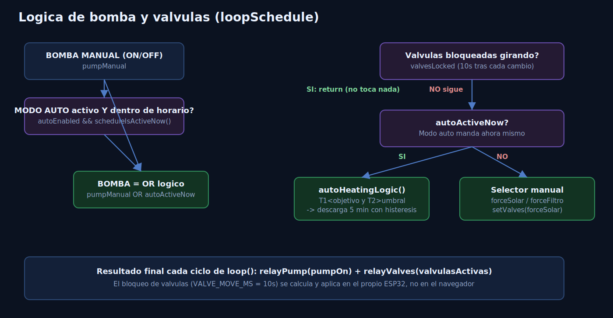

# 🌊 Control Jacuzzi ESP32

**Firmware + web de control en tiempo real para un jacuzzi de 1 m³ con calentamiento solar por serpentín.**
ESP32 DevKit/NodeMCU-32S · sin filesystem externo · sin nube · sin dependencias raras.


📘 **Manual de usuario** (instalación, primer arranque, uso diario paso a paso):
**[Manual_Usuario_Jacuzzi_Controller.docx](Manual_Usuario_Jacuzzi_Controller.docx)**

---

## Índice

- [¿Qué hace este proyecto?](#qué-hace-este-proyecto)
- [Arquitectura del firmware](#arquitectura-del-firmware)
- [Estructura del proyecto](#estructura-del-proyecto)
- [Librerías necesarias](#librerías-necesarias-gestor-de-librerías-del-ide-de-arduino)
- [Configuración de la placa](#configuración-de-la-placa)
- [Cableado](#cableado-ver-comentarios-detallados-en-configh)
- [Lógica de control (botones)](#lógica-de-control-botones)
- [Calibración y ajustes de temperatura](#calibración-y-ajustes-de-temperatura)
- [Conexión WiFi: captive portal bajo demanda](#conexión-wifi-captive-portal-bajo-demanda)
- [Actualización OTA](#actualización-ota)
- [Histórico remoto: servidor Python](#histórico-remoto-servidor-python)
- [Control de tiras LED por Bluetooth](#control-de-tiras-led-por-bluetooth)
- [Páginas web y API](#páginas-web-y-api)
- [Diagnóstico y salud del sistema](#diagnóstico-y-salud-del-sistema)
- [Monitor Serie](#monitor-serie-115200-baudios)
- [Notas de diseño](#notas-de-diseño)
- [Preguntas frecuentes / troubleshooting](#preguntas-frecuentes--troubleshooting)

---

## ¿Qué hace este proyecto?

Este ESP32 sustituye la placa de control original del jacuzzi (rota) por
un firmware propio que:

- Lee la temperatura del agua del jacuzzi y la del serpentín solar
  (2 sensores NTC10k).
- Enciende la bomba y mueve las válvulas para dirigir el agua por el
  **filtro** (circuito directo) o por el **serpentín solar** (desvío
  de calentamiento), según un programa horario y/o control manual.
- Aplica una lógica de histéresis para no encender/apagar el
  calentamiento solar a cada rato cuando las temperaturas están muy
  cerca del límite.
- Expone todo esto en una **web de control en tiempo real** (WebSocket)
  con estética de panel técnico, accesible desde el móvil sin
  instalar nada.
- Guarda un **histórico de temperaturas** (`/datos`) y un **histórico
  de diagnóstico** (`/diag`) para poder investigar problemas días
  después de que ocurran, sin depender de tener el Monitor Serie
  abierto en el momento exacto. Ambos históricos se envían a un
  **servidor local en Python** (ver [más abajo](#histórico-remoto-servidor-python)),
  así que ya no están limitados por la memoria del ESP32.
- Controla, opcionalmente, **tiras de LED RGB por Bluetooth** (las
  tiras BLE genéricas tipo "Happy Lighting") con color, efectos y
  programas horarios propios, desde su propia página `/leds` (ver
  [más abajo](#control-de-tiras-led-por-bluetooth)).

La lógica de control del jacuzzi (temperaturas, bomba, válvulas,
programa horario) corre **siempre dentro del propio ESP32**: sin nube,
sin apps de terceros, sin cuenta que crear. Si tu router se cae, el
jacuzzi sigue controlándose solo según su programa; lo único que deja
de funcionar sin red es el envío del histórico al PC y el control de
las tiras LED (ambos no son necesarios para el funcionamiento del
jacuzzi en sí).

## Arquitectura del firmware


El `.ino` **no contiene lógica propia**: solo inicializa y llama a
`setup()`/`loop()` de cada módulo. Todos los módulos leen y escriben
sobre un único estado compartido (`g_state`, definido en `data.h`), lo
que mantiene cada archivo pequeño, independiente y fácil de reutilizar
en otro proyecto. La única excepción es `tiras_led.*` (control de LEDs
por BLE): es completamente autocontenido y no toca `g_state`, para que
pueda copiarse a otro proyecto sin arrastrar nada del jacuzzi.

Desde la migración del histórico, `datalog.*` y `diaglog.*` ya no
guardan datos en el propio ESP32: actúan como **cliente HTTP** hacia un
servidor Python que corre en un PC de la red local (carpeta
`jacuzzi_server_LOCAL_API_HTML/`). El resto de módulos no lo notan: la
interfaz pública de `datalog`/`diaglog` no cambió.



## Estructura del proyecto

```
esp32_jacuzzi/
├── esp32_jacuzzi.ino    -> Solo llama a setup/loop de cada módulo
├── config.h             -> Pines y constantes (LEER ANTES DE CABLEAR)
├── data.h               -> Estado global compartido (g_state)
├── storage.*            -> Guardado persistente (NVS / Preferences)
├── wifi_manager.*       -> WiFi: redes conocidas + portal de configuración
├── relays.*             -> Control de bomba y válvulas
├── temp_sensors.*       -> Lectura de los 2 NTC10k (jacuzzi y solar)
├── schedule.*           -> Programa horario + lógica de modo automático
├── ota.*                -> Actualización de firmware por WiFi
├── datalog.*            -> Histórico de temperaturas/eventos (envía al servidor Python, gráfica /datos)
├── diaglog.*            -> Registro de diagnóstico (envía al servidor Python, heap/wifi/reinicios)
├── tiras_led.*          -> Control de tiras LED RGB por BLE (página /leds, autocontenido)
├── web_server.*         -> Servidor web + WebSocket
├── webpage.*            -> HTML de la app principal embebido en PROGMEM
├── datapage.*           -> HTML de la página /datos embebido en PROGMEM
├── diagpage.*           -> HTML de la página /diag embebido en PROGMEM
└── jacuzzi_server_LOCAL_API_HTML/  -> Servidor Python (FastAPI+SQLite) que guarda el histórico, corre en un PC de la red local
```

Cada módulo `.h`/`.cpp` está documentado en su propia cabecera con el
"por qué", no solo el "qué" — léelos antes de tocar algo, casi siempre
la duda ya está resuelta ahí.

## Librerías necesarias (Gestor de Librerías del IDE de Arduino)

- **ESPAsyncWebServer** (me-no-dev / ESP32Async)
- **AsyncTCP** (dependencia de la anterior)
- **ArduinoJson** (v6 o v7)
- **NimBLE-Arduino** (cliente BLE ligero, solo necesario si usas el
  módulo de tiras LED, `tiras_led.*`)
- Todo lo demás (WiFi, WebServer, DNSServer, Preferences, ArduinoOTA,
  `HTTPClient` para el histórico remoto, analogRead de los NTC) ya
  viene incluido con el core de ESP32 para Arduino, sin librerías
  externas adicionales.

Además, para guardar el histórico necesitas **Python 3** corriendo en
un PC de tu red local (ver [Histórico remoto](#histórico-remoto-servidor-python));
sus dependencias (`fastapi`, `uvicorn`, `pydantic`) están en
`jacuzzi_server_LOCAL_API_HTML/requirements.txt` y se instalan solas.

## Configuración de la placa

- Placa: **ESP32 DevKit / NodeMCU-32S**
- Partición: cualquiera por defecto sirve (no se usa ningún sistema de
  ficheros; la web viaja embebida dentro del propio sketch).
- Sube el sketch normalmente por USB, como cualquier otro proyecto de
  Arduino. No hay que subir nada aparte.

## Cableado (ver comentarios detallados en `config.h`)

| Señal                                    | Pin ESP32 DevKit |
|-------------------------------------------|:---:|
| NTC T1 (jacuzzi)                           | GPIO 32 |
| NTC T2 (solar)                             | GPIO 33 |
| Relé 1 — Bomba/Motor                       | GPIO 4  |
| Relé 2 — Ambas válvulas (V1 NA / V2 NC)    | GPIO 17 |
| Relé 4 — Libre / futuro                    | GPIO 18 |
| Botón reset WiFi (botón BOOT)              | GPIO 0  |
| LED de estado (LED azul on-board)          | GPIO 2  |

Los relés se colocaron en pines libres del NodeMCU-32S (GPIO 4, 17,
18), sin conflicto con el flash ni con los NTC (32/33). Si tu módulo
lleva PSRAM (variante WROVER) no uses el GPIO 17, ya que está
reservado internamente; en un NodeMCU-32S normal (WROOM) está libre.

Las dos válvulas se mueven con un **único relé**: al estar una en
posición Normalmente Abierta y la otra en Normalmente Cerrada, activar
o desactivar ese relé las deja siempre en posiciones opuestas (reposo
= filtro directo / activado = desvío al serpentín solar).

Si tu módulo de relés es activo en HIGH en vez de en LOW, cambia
`RELAY_ACTIVE_LOW` a `false` en `config.h`.

### Esquema de conexión de los sensores NTC


**Sensores NTC10k B3950 (analógicos, 2 hilos, sin polaridad):** cada
uno va en un divisor de tensión 3.3V — resistencia fija de 10kΩ — NTC
— GND, y el ESP32 lee el nodo intermedio. GPIO32 y GPIO33 son del
ADC1, que a diferencia del ADC2 **sí** es fiable con el WiFi activo,
así que no hay ninguna limitación de hardware que tener en cuenta
aquí.

## Lógica de control (botones)

Los 4 controles principales de la web son independientes entre sí,
salvo el par forzado que es excluyente:

- **MODO AUTO** (ON/OFF propio): si está en ON, el programa horario
  configurado puede mandar sobre bomba y válvulas cuando esté dentro
  de su horario. En OFF, el programa no actúa aunque su horario esté
  activo.
- **BOMBA MANUAL** (ON/OFF propio): fuerza la bomba encendida a mano,
  independientemente del auto. Útil para tener circulación cuando no
  hay programa corriendo. La bomba real es la suma lógica de ambos:
  `pumpManual OR (autoEnabled && horario activo)`.
- **FORZAR SOLAR / FORZAR FILTRO**: selector de 2 posiciones
  mutuamente excluyentes para las válvulas. Solo tiene efecto cuando
  el modo auto no está mandando en ese instante (auto desactivado o
  fuera de horario); si el auto está activo y en horario, es
  `autoHeatingLogic()` (con histéresis, ver `schedule.cpp`) quien
  decide las válvulas según temperaturas.

Toda esta lógica vive en `schedule.cpp` (`loopSchedule()`,
`setAutoEnabled()`, `setPumpManual()`, `setForceSolar()`) y en el
estado de `data.h` (`autoEnabled`, `pumpManual`, `forceSolar`).

## Calibración y ajustes de temperatura

En el listado de información de la web:

- **T1 JACUZZI / T2 SOLAR**: al tocar cada fila se despliega un panel
  con botones `−`/`+` para aplicar un offset de calibración a ese
  sensor (paso 0.5 °C, sin límite). El offset se suma a la lectura del
  NTC correspondiente, se aplica al instante sobre la temperatura ya
  mostrada (sin esperar al siguiente muestreo) y queda guardado en NVS
  (persiste tras reiniciar).
- **TEMP. DESCARGA SOLAR**: valor ajustable (paso 0.5 °C) que
  representa un límite de referencia para el sensor del serpentín. Por
  ahora es solo informativo: se guarda en NVS pero no afecta a la
  lógica de control.

Todo esto se guarda en el mismo namespace `temp` de `storage.cpp`
(`storageLoadTempOffsets`/`storageSaveTempOffsets`,
`storageLoadSolarDischargeTemp`/`storageSaveSolarDischargeTemp`).

## Conexión WiFi: captive portal bajo demanda

Para no dejar una puerta de entrada abierta 24/7 (este ESP32 controla
relés de bomba y válvulas), el punto de acceso de configuración NO es
permanente, pero es un **captive portal completo**: al conectarte a
él, tu móvil/PC abre la página de configuración sola, como el WiFi de
un bar o un hotel (sin tener que teclear ninguna dirección).

1. **En cada arranque**, el ESP32 abre automáticamente durante
   **5 minutos** (`AP_CONFIG_WINDOW_MS` en `config.h`) la red
   **`Jacuzzi-Config`** (password `12345678`) como red de seguridad,
   mientras intenta conectarse en paralelo a sus redes conocidas.
2. Si logra conectar antes de que pasen esos 5 minutos, el AP **se
   cierra solo**. Si nunca logra conectar a ninguna, se queda abierto
   **indefinidamente** (es la única vía de entrada que le queda).
3. **Bajo demanda**: en la app web hay un botón **CONFIGURAR WIFI** que
   activa el mismo captive portal en cualquier momento, SIN reiniciar
   el ESP32 (usa el modo dual AP+STA: sigue conectado a tu red de casa
   mientras el AP de configuración está activo en paralelo).
4. Al conectarte a `Jacuzzi-Config`, la página de gestión se abre sola
   y permite:
   - **Escanear y añadir** redes nuevas.
   - **Priorizar** las redes guardadas con las flechas ▲▼ (la de
     arriba del todo es la que se intenta conectar primero si está
     visible; ya NO se elige por intensidad de señal, sino por el
     orden que tú decidas).
   - **Eliminar** redes guardadas.
   - **Guardar y salir**: reinicia el ESP32 para aplicar los cambios y
     reconectarse con la nueva configuración.

Si tras publicar el proyecto en tu red algún móvil no abre la página
de configuración automáticamente al conectarse (varía según fabricante
y versión de Android/iOS), siempre puedes entrar manualmente a
`http://192.168.4.1`.

## Actualización OTA

Una vez el ESP32 está en tu red, aparecerá en el IDE de Arduino como
puerto de red (`jacuzzi-esp32`) para subir nuevo firmware sin cable.

## Histórico remoto: servidor Python

Desde esta migración, el histórico de temperaturas (`/datos`) y el de
diagnóstico (`/diag`) **ya no se guardan en el ESP32**: se envían por
HTTP a un servidor propio en Python (FastAPI + SQLite) que debe correr
24/7 en un PC de la misma red local. El ESP32 sigue siendo el único
que controla el jacuzzi (relés, sensores, programa); ese servidor
**solo guarda y sirve datos**, no participa en el control.

- Código y guía de instalación completa (arranque en Windows,
  `start_server.bat`, cómo dejarlo corriendo como servicio, acceso
  remoto con Tailscale...): **[jacuzzi_server_LOCAL_API_HTML/README.md](jacuzzi_server_LOCAL_API_HTML/README.md)**.
- En el ESP32, ajusta en `config.h`: `REMOTE_LOG_SERVER_URL` (IP o
  nombre mDNS del PC) y `REMOTE_LOG_API_KEY` (debe coincidir con la
  clave `JACUZZI_API_KEY` del servidor).
- El envío no bloquea el `loop()`: una tarea aparte (núcleo 0) hace las
  peticiones HTTP con un timeout corto (`REMOTE_LOG_HTTP_TIMEOUT_MS`,
  1.5 s por defecto). Si el PC no responde, las muestras se quedan en
  un pequeño buffer de emergencia en RAM (`REMOTE_LOG_FALLBACK_CAPACITY`
  = 100 para temperaturas, `REMOTE_DIAG_FALLBACK_CAPACITY` = 30 para
  diagnóstico) y se reintentan solas en cuanto el servidor vuelve.
- El breadcrumb de memoria RTC y el pico de duración de `loop()` del
  diagnóstico **siguen siendo locales a propósito**: no pueden
  depender de la red para registrar por qué se colgó el firmware.
- Ventaja frente al esquema anterior (buffer circular en NVS): el
  historial deja de estar limitado a ~7-10 días (temperaturas) o
  ~16-17 horas (diagnóstico); ahora no tiene límite práctico de
  capacidad, al vivir en una base de datos SQLite en el PC.

## Control de tiras LED por Bluetooth

Módulo opcional (`tiras_led.*`) para controlar tiras de LED RGB
genéricas BLE (las típicas "smart LED strip" de AliExpress que de
fábrica se manejan con apps como "Happy Lighting"), desde su propia
página **`/leds`** con el mismo estilo visual que el resto de la web.
Es completamente autocontenido: no toca el estado del jacuzzi ni
ningún otro módulo, así que puede copiarse tal cual a otro proyecto.

- **Emparejamiento**: escaneo BLE bajo demanda (6 s) desde `/leds`;
  hasta 6 tiras en el grupo a la vez, identificadas por su MAC, con
  reconexión automática y backoff si alguna se desconecta.
- **Color, brillo y ~29 efectos nativos** (calculados por la propia
  tira, no por el ESP32) agrupados en estáticos, saltos, crossfade y
  blink, con velocidad ajustable.
- **Programas horarios**: hasta 5 programas (días de la semana + hora
  de encendido/apagado), aplicados por `ledsLoop()` sin bloquear el
  resto del firmware.
- Todo (tiras emparejadas, color, brillo, efecto, velocidad y
  programas) se persiste en NVS y se recarga solo al arrancar.
- Límite importante: NimBLE-Arduino reserva como mucho
  `LEDS_MAX_CONCURRENT_CONNECTIONS` (6) conexiones BLE simultáneas por
  defecto; si necesitas más tiras conectadas a la vez hay que subir
  ese límite de compilación de la librería.

## Páginas web y API

| Ruta | Método | Contenido |
|---|:---:|---|
| `/` | GET | App principal de control (o portal de configuración WiFi si se accede desde el AP) |
| `/datos` | GET | Gráfica del histórico de temperaturas y eventos (semana completa, zoom, donuts de reparto) |
| `/api/history` | GET | Histórico en JSON (hasta 7 días), usado por `/datos`. El ESP32 lo pide al servidor Python |
| `/api/history/deleteday` | POST | Borra el registro de un día (botón "borrar día" de `/datos`) |
| `/api/history/format` | POST | Formatea el histórico de temperaturas (borrado total) |
| `/diag` | GET | Panel de diagnóstico: heap, WiFi, clientes, reinicios |
| `/api/diag` | GET | Muestras de diagnóstico en JSON + intervalo de muestreo actual |
| `/api/diag/clear` | POST | Borra el histórico de diagnóstico |
| `/api/diag/interval` | POST | Cambia el intervalo de muestreo del diagnóstico (`?ms=`) |
| `/leds` | GET | Página de control de tiras LED por BLE |
| `/api/leds/state` | GET | Estado actual de las tiras (color, brillo, efecto, programas) en JSON |
| `/api/leds/scan` | POST | Inicia un escaneo BLE de 6 s para buscar tiras nuevas |
| `/api/leds/scanresults` | GET | Resultado del escaneo en curso (MAC, nombre, RSSI de cada tira encontrada) |
| `/api/leds/command` | POST | Envía un comando a las tiras (color, brillo, efecto, velocidad, emparejar/quitar, programas) |
| `/ws` | — | WebSocket: estado en tiempo real + envío de comandos |

`/api/history` y `/api/diag` en realidad las sirve ahora el servidor
Python (el ESP32 solo hace de intermediario para que `/datos` y `/diag`
no necesiten cambios); el resto de rutas de esta tabla las sigue
sirviendo el propio ESP32.

## Diagnóstico y salud del sistema

La página `/diag` existe para responder a la pregunta más incómoda de
cualquier proyecto embebido: *"¿por qué se ha reiniciado solo mientras
yo dormía?"* — sin tener que pillarlo con el Monitor Serie abierto en
el momento exacto.

Qué guarda cada muestra (`diaglog.*`, enviada al
[servidor Python](#histórico-remoto-servidor-python), independiente del
histórico de temperaturas):

- **Motivo de arranque** (`esp_reset_reason`): encendido normal, reset
  externo, software, **PANIC**, watchdog (interno/tarea/otro),
  brownout, salida de deep sleep, SDIO.
- **Breadcrumb**: en qué zona del `loop()` (WiFi, OTA, sensores,
  programa, datalog, servidor web, diagnóstico, broadcast) se quedó
  colgado el firmware justo antes de un reset por PANIC/watchdog/
  brownout — guardado en RAM de RTC, sobrevive al propio reset.
- **Heap libre**, **heap mínimo histórico** y **mayor bloque
  asignable de un tirón** (para detectar fugas de memoria y
  fragmentación por separado).
- **Stack libre mínimo** de la tarea principal.
- **Duración máxima de una vuelta de `loop()`** desde la muestra
  anterior (picos altos anticipan un reset por watchdog).
- WiFi: conectado/no, RSSI, reconexiones acumuladas.
- Clientes WebSocket conectados y errores de lectura NTC acumulados.

Y en la propia página:

- **Resumen** con el estado actual y semáforo de color (verde/ámbar/
  rojo) para cada métrica.
- **Gráfica de heap libre** en el tiempo, más dos mini-gráficas (stack
  libre mínimo y loop más lento por muestra) para ver tendencias de un
  vistazo.
- **Gráfica de barras** con el uptime alcanzado justo antes de cada
  reinicio no normal — ayuda a ver si los reinicios se agrupan
  (siempre a las pocas horas) o son esporádicos.
- **Slider de frecuencia de registro** (1-30 min, por defecto 5):
  cambia el intervalo en caliente sin recompilar, persistido en NVS
  (es lo único que sigue guardándose en el ESP32; las muestras en sí
  van al servidor Python, que ya no tiene un límite de capacidad fijo
  como el antiguo buffer NVS de 200 entradas).
- **Tabla completa** del histórico, con los reinicios no normales
  resaltados.
- Botón para **borrar el historial** de diagnóstico.

## Monitor Serie (115200 baudios)

Todo el arranque y el funcionamiento imprime mensajes con un prefijo
por módulo para poder seguir lo que ocurre: `[MAIN]`, `[WIFI]`,
`[RELAYS]`, `[TEMP]`, `[SCHED]`, `[WEB]`, `[OTA]`, `[DIAG]`,
`[DATALOG]`, `[LEDS]`. Por ejemplo, al arrancar verás el orden de
inicialización, si conectó a una red conocida o abrió el portal de
configuración, el motivo del último reset, las lecturas de temperatura
cada `SENSOR_READ_MS`, los cambios de válvulas/modo, el resultado de
cada envío HTTP al servidor Python (`[DATALOG]`), y cuándo un cliente
web se conecta o envía un comando.

## Notas de diseño

- **Un único servidor web** (`web_server.cpp`, puerto 80) sirve tanto
  la app normal como las rutas del captive portal de configuración
  WiFi. Es importante que sea uno solo: dos servidores distintos
  escuchando el mismo puerto 80 a la vez provocan conflictos de red
  (fue exactamente el bug de una versión anterior: abrir la app
  estando ya conectado acababa mostrando la página de configuración
  WiFi, porque el servidor equivocado respondía a la petición). Las
  rutas del portal solo responden de verdad mientras el AP está
  activo; si no, devuelven 404.
- La web está **embebida en el firmware** (`webpage.cpp`, PROGMEM), no
  se usa ningún sistema de ficheros (LittleFS/SPIFFS): esto evita
  problemas de montaje/formateo del filesystem y simplifica subir el
  proyecto (un único sketch, sin pasos adicionales). El único
  inconveniente es que para editar el HTML hay que volver a compilar y
  subir el sketch completo.
- Toda la lógica de negocio vive en el ESP32; la web **solo refleja**
  el estado y **envía órdenes de configuración** (programa horario,
  temperatura objetivo, modo, redes WiFi). No hay ninguna simulación
  en el HTML: los valores mostrados vienen siempre del WebSocket.
- El bloqueo de 10 s de los botones de modo mientras las válvulas
  giran (`VALVE_MOVE_MS` en `config.h`) se calcula y aplica en el
  propio ESP32 (`schedule.cpp`), no en el navegador.
- La hora se sincroniza por NTP al conectar (ajusta el huso horario en
  la llamada a `configTime()` dentro de `esp32_jacuzzi.ino`), y
  también puede ajustarse manualmente desde el panel de programa de la
  web.
- **Watchdog software**: si `loop()` se cuelga y no se "alimenta"
  durante `WATCHDOG_TIMEOUT_S` (20 s), el ESP32 se reinicia solo — y
  queda constancia del motivo y del punto exacto en `/diag`.
- **Reconexión WiFi con backoff**: los reintentos de conexión crecen
  progresivamente (`WIFI_RETRY_MIN_MS` → `WIFI_RETRY_MAX_MS`) para no
  saturar el radio si nunca hay red disponible.
- **Histórico y diagnóstico**: `datalog.*` envía temperaturas/eventos
  para la gráfica de `/datos`, y `diaglog.*` envía heap libre, stack,
  duración de loop, RSSI y motivo de reinicio para investigar cuelgues
  desde `/diag`; ambos al [servidor Python](#histórico-remoto-servidor-python)
  de la red local, con un pequeño buffer de emergencia en RAM del
  propio ESP32 para cubrir cortes puntuales del servidor.
- **Tiras LED por BLE**: `tiras_led.*` es autocontenido y no depende
  del resto de módulos ni de `g_state`; si el jacuzzi no tiene tiras
  LED, basta con no llamar a `ledsInit()`/`ledsLoop()` desde el `.ino`
  (o dejar el grupo de tiras vacío) para que el módulo no haga nada.
- **Interfaz visual**: paleta oscura tipo panel técnico/laboratorio
  (verde ámbar sobre negro), consistente entre `/`, `/datos` y `/diag`,
  con estados representados por color (pastillas verdes/rojas,
  selectores segmentados) en vez de solo texto, para leer el estado
  del sistema de un vistazo.

## Preguntas frecuentes / troubleshooting

**El ESP32 se reinicia solo y no sé por qué.**
Entra en `/diag`: la tabla te dice el motivo exacto (PANIC, watchdog,
brownout...) y, si fue por un cuelgue, en qué zona del `loop()` se
quedó. Revisa también la gráfica de heap por si hay una fuga de
memoria y la de barras de reinicios por si hay un patrón temporal.

**El móvil no me abre la página de configuración WiFi solo.**
Conéctate a la red `Jacuzzi-Config` y entra manualmente a
`http://192.168.4.1`.

**He editado el HTML de la web y no veo el cambio.**
La web va embebida en el firmware (PROGMEM), no en un filesystem
aparte: hay que volver a compilar y subir el sketch completo.

**Quiero más o menos frecuencia en el histórico de diagnóstico.**
Desde `/diag`, mueve el slider de "Frecuencia de registro" (1-30 min).
Se aplica al momento y se guarda solo.

**`/datos` o `/diag` aparecen vacíos o sin datos nuevos.**
Comprueba que el servidor Python esté corriendo en el PC
(`http://IP_DEL_PC:8000/api/health` debe responder `{"ok":true}`) y que
`REMOTE_LOG_SERVER_URL`/`REMOTE_LOG_API_KEY` en `config.h` coincidan
con la IP y la clave del servidor. Mientras el PC esté apagado, las
últimas muestras se guardan en el buffer de emergencia del ESP32 y se
envían solas en cuanto el servidor vuelve a responder.

**No me aparecen tiras LED al escanear desde `/leds`.**
Asegúrate de que la tira esté encendida y dentro de alcance BLE, y de
que no esté ya conectada desde el móvil por su app original (una tira
BLE solo admite una conexión activa a la vez). El escaneo dura 6 s;
si no aparece, vuelve a pulsar "Buscar tiras".
